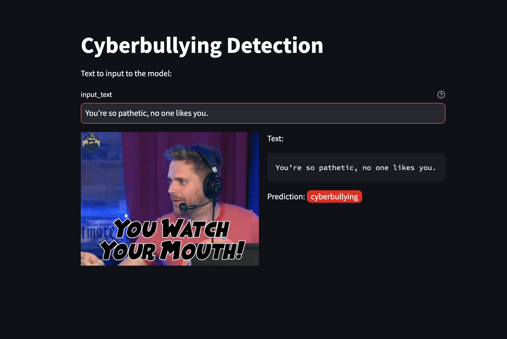
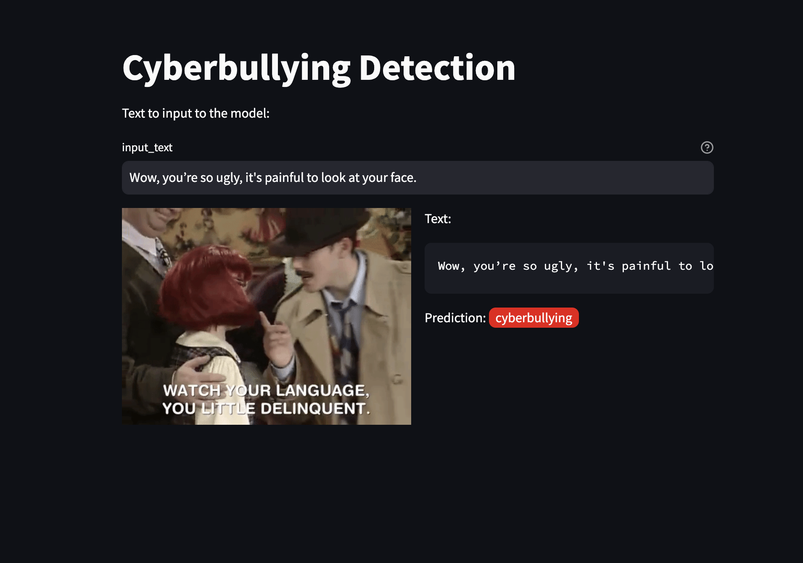
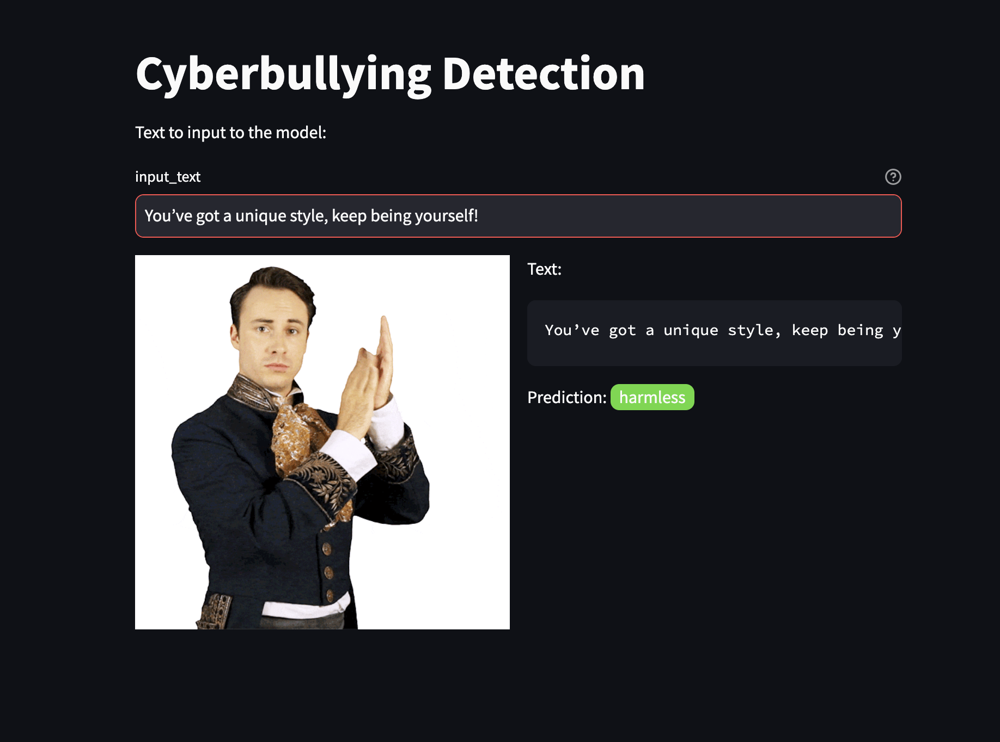
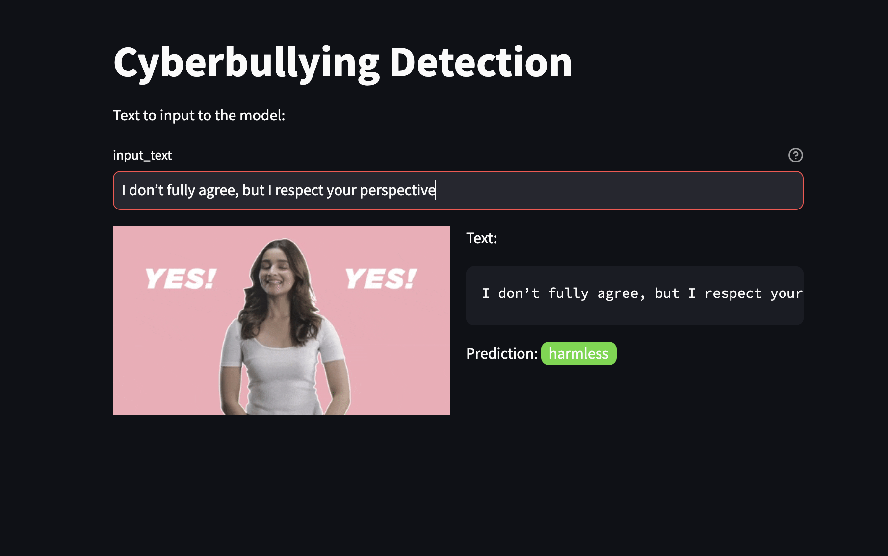

# Cyberbullying Detection

This project is focused on developing a deep learning model to detect and classify hate speech, toxic comments, and cyberbullying content on online platforms. The key goal is to create a robust, scalable, and reproducible MLOps pipeline for building and serving deep learning projects to the cloud.

The project is divided into four parts(each in its own repo). Refer to [Part 1](https://github.com/morpheus-101/cybulde-data) for details on project overview.
- Part 1: [Data collection and versioning](https://github.com/morpheus-101/cybulde-data)
- Part 2: [Distributed data processing](https://github.com/morpheus-101/cybulde-data-preparation)
- Part 3: [Distributed model training and evaluation](https://github.com/morpheus-101/cybulde-model)
- Part 4: [Deployment and web app](https://github.com/morpheus-101/cybulde-web-app)

This repository includes code for Part 4 only. 

---

# Part 4:
Building upon the model developed and evaluated in Part 3, this phase focuses on deploying and operationalizing the cyberbullying detection system. MLflow is leveraged to access the trained model, along with its associated metadata, artifacts, dataset versions, and parameters. A REST API is constructed using FastAPI, enabling real-time predictions on text inputs. To ensure scalability and portability, the API is containerized using Docker, with images stored in Google Artifact Registry.

The deployment architecture utilizes Google Cloud Platform, with the API hosted on a Google Compute Engine instance. For user interaction, an intuitive web application is developed using Streamlit, providing an interface to test the cyberbullying detection model.

Here are some screenshots of the web app [the meme-picture in the screenshots is just for fun :)]:

- For harmful texts with cyberbullying content:

  

  

- For harmless texts:

  

  

